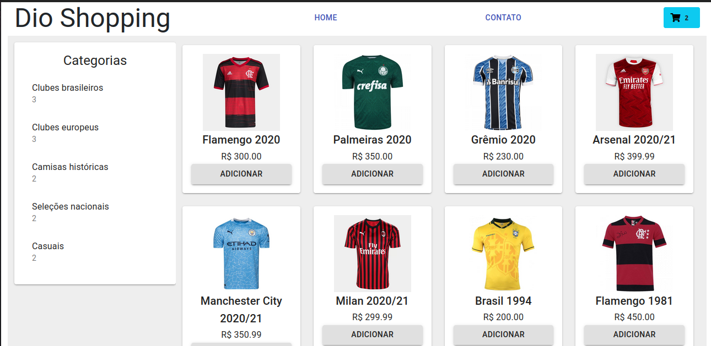

# Dio shopping

Este projeto foi efeito no bootcamp da digital innovation one. Que é site de uma loja, que integra com um backend em node.js.

## Resultado



## Tecnologias utilizadas

* React com o redux
* Javascrip
* CSS3 e HTML5

## Para iniciar a aplicação

```bash
yarn run start
```

Tambem pode ser utilizado npm.
